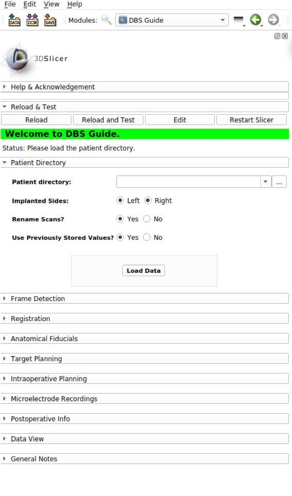
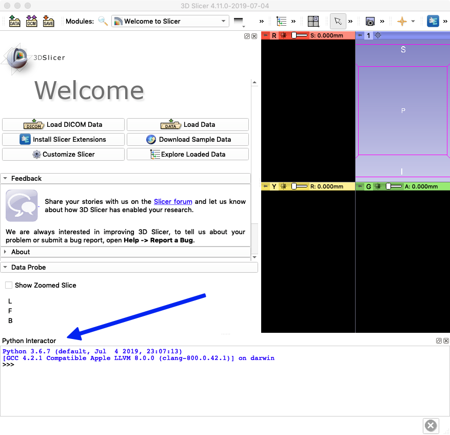

 
[Click to view presentation on dbsGuide.](https://gitpitch.com/greydongilmore/slideshows/master?p=labretreat_2019#/) 

# DBS Guide
## open-source neurosurgical planning software
### *Greydon Gilmore & Wafiq Syed (London Health Sciences Centre)*

#### What is DBS?
**DBS, short for Deep Brain Stiumation,** is is an established surgical treatment for people with movement disroders, such as Parkinson's disease and dystonia. It involves implanting electrodes (thin metal wires) within certain areas of the brain and sending electrical impulses through these electrodes.

#### What is DBS Guide?
DBS Guide is a surgical planning and postoperative assessmen that can be incorporated into 3D Slicer as an extension module. DBS Guide works to visualize the postoperative localization of the microelectrodes in the patient's brain, by displaying the microelectrodes on the patient's MRI and/or CT scans. Analyzing the visualization that DBS Guide provides, it can be determined if the microelectrodes have been implanted successfully at the planned target area, the subthalamaic nucleus (STN).

 
#### What you need to use DBS Guide

| Software                                  | Tested version |
|-------------------------------------------|----------------|
| [3D Slicer](https://download.slicer.org/) | 4.11.0         |

## Installation
Once you have installed 3D Slicer, follow these steps:
1. Download the latest version of DBS Guide [here](https://github.com/greydongilmore/dbsGuide/archive/master.zip).
2. Unzip the folder and save it somewhere on your system. For this tutorial, the file has been saved in Desktop. 
3. Open Slicer. It should look like this: 

3. We need to load the DBS Module now. Go to the top menu on Slicer and next to **"Modules"**, select **"Extension Wizard."** Then under Extension Tools, press **"Select Extension."** 

4. 
For more documentation on what DBS Guide offers and how to use it, please visit: https://afids.readthedocs.io/en/latest/#
